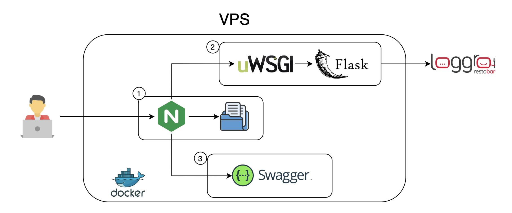

<head>
  <link rel="stylesheet" href="docs/styles/styles.css">
</head>

<div class="headerImages">
    
    
</div>

# Automatic User Registration
<p>
Nowadays, user registration is a required task that companies must complete before generating a receipt. This task is usually performed manually, which can be time-consuming and prone to errors.
This project aims to solve that problem by providing an automated user registration system that simplifies the process of registering users in a commercial POS system.
The application exposes an API to get, update, and create customers in the POS system. Currently, only <strong>Loggro</strong> is supported.
<p>
<br>

# How it works?
<p>
The systems consists of a group of containers that you can run with the following command:
<p>

```bash
docker-compose up
```

<p>
This will start a Nginx reverse proxy, flask application and a Swagger UI. Below is a diagram of the architecture:
</p>

<br>
<br>
<ul>
<li><b>Nginx</b>: We use it to manage routing. Depending on the path, the request will be directed to the API service, the Swagger documentation, or the static files, which contain a front-end application.</li>
<li><b>API</b>: Here we have the Flask application running on uWSGI. The service exposes endpoints to validate, get, update, and create customers.</li>
<li><b>Swagger</b>: Provides the API documentation.</li>
</ul>

# Environment Variables
