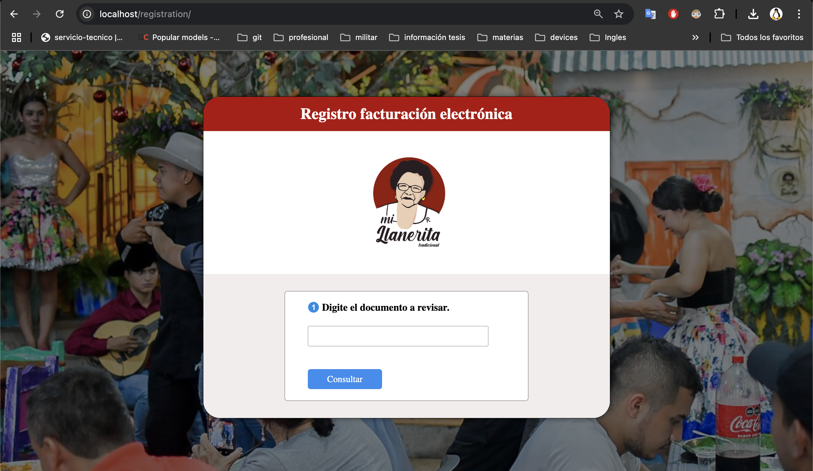

<head>
  <link rel="stylesheet" href="docs/styles/styles.css">
</head>

<div class="headerImages" align="center">
    
    
</div>

<br>
<br>

# Automatic User Registration
<p>
Nowadays, user registration is a required task that companies must complete before generating a receipt. This task is usually performed manually, which can be time-consuming and prone to errors.
This project aims to solve that problem by providing an automated user registration system that simplifies the process of registering users in a commercial POS system.
The application exposes an API to get, update, and create customers in the POS system. Currently, only <strong>Loggro</strong> is supported.
<p>
<br>

# How it works?
<p>
The systems consists of a group of containers that you can run with the following command:
<p>

```bash
docker-compose up
```

<p>
This will start a Nginx reverse proxy, flask application and a Swagger UI. Below is a diagram of the architecture:
</p>

<br>
<br>
<ul>
<li><b>Nginx</b>: We use it to manage routing. Depending on the path, the request will be directed to the API service, the Swagger documentation, or the static files, which contain a front-end application.</li>
<li><b>API</b>: Here we have a Flask application running on uWSGI. The service exposes endpoints to validate, retrieve, update, and create customers. It acts as a bridge to connect customers to the POS system without exposing credentials.</li>
<li><b>Swagger</b>: Provides the API documentation.</li>
</ul>


**Warning:** The static files were defined for a specific company. You might need to change these two images:
<a href="nginx/dist/font/registration/assets/images/background.jpg" target="_blank">background.jpg</a> and
<a href="nginx/dist/font/registration/assets/images/logo.png" target="_blank">logo.jpg</a>


## Environment Variables
As you may know, the application uses environment variables to configure the service. You must provide a <b>.env </b> file at the root of the project
with the following variables:

```env
export APP_MODE=uwsgi
export LOG_LEVEL=INFO
export IP=0.0.0.0
export PORT=8080
export PIRPOS_USER_NAME=loggro-email@gmail.com
export PIRPOS_PASSWORD=loggro-password
```

If the APP_MODE variable contains any other value, then the Flask application will be launched in debug mode (see <a href="entrypoint.sh" target="_blank">entrypoint.sh</a>)


## API Endpoints

The exposed endpoints are explained in the <a href="docs/openapi.yaml" target="_blank">Swagger documentation</a>
. Here you will find the request parameters and which responses will be returned. If the Swagger conainer is already running, then 
you can access it using the following <a href="http://localhost/docs" target="_blank">link</a>.


## Front-end Application

The front-end application was built with Angular and is located in the <b>nginx/dist/font/registration</b> folder. 
If you prefer to use your own front-end application, you can update the static files. Make sure to review the 
Nginx <a href="nginx/default.conf" target="_blank">configuration</a> to ensure everything works properly.


